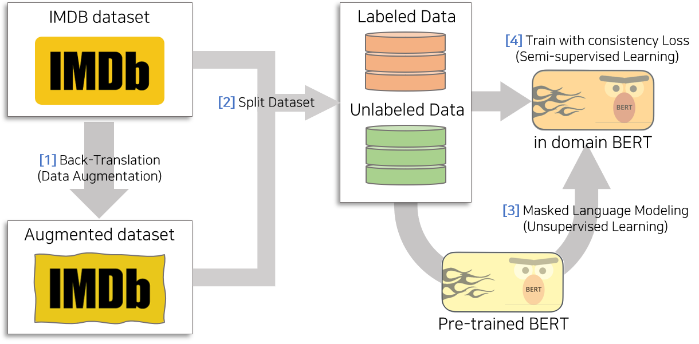

# UDA Pytorch
This is pytorch implementation project of [**Unsupervised Data Augmentation for consistency Training, NeurIPS 2020**](https://arxiv.org/abs/1904.12848)

## Overview
In this implementation, I focus on IMDB Sentiment Analysis(NLP Task).
Because of low resources(1 GPU RTX 2080ti), test is only conducted with small token length(128).
Please aware that BERT in this implementation is pretrained from from huggingface(bert-base-uncased).




There is 4 steps to reproduce results in paper

1. Back-Translation(Data Augmentation)
2. Split Dataset into train file for supervised, train file for consistency, valid file 
3. Masked Language Modeling to make task adapted pre-trained Model
4. Training with consistency Loss(UDA)

Model                  | Number of labeled examples | Error rate(this implementation)
---------------------- | :------------------------: | :--------:
BERT                   | 25,000                     | 5.69
BERT                   | 20                         | 29.22
BERT(task adapted)     | 20                         | 29.34
UDA                    | 20                         | **8.20**
UDA(task adapted)      | 20                         | **8.20**

## Requirements
The code is tested on Python 3.7 and Pytorch 1.7.1
Detail Description about develop environment is provided with [`requirements.txt`](requirements.txt)  
[DockerFile](Dockerfile) is also supported in gitRepos. So feel free to enjoy it by using few commands

## Instructions

#### [1] Back-Translation(Data Augmentation)
Back-translation need a long time to run.
```shell
# [1] Back-Translation(Data Augmentation)
bash scripts/run_backtranslation.sh

# [2] Split Dataset
bash scripts/split_data.sh

# [3] Masked Language Modeling


# [4.1] Run supervised learning
# Baseline accuracy: around 70%
bash scripts/run_base.sh

# [4.2]
```


## Comments
Unlike other supervised-learning, This implementation is very sensitive to many hyper-parameter such as `confidence_beta`, `unlabel_batch_size`, `train_max_len`.
Even `seed` make big fluctuating in test accuracy.
So hyper-parameter search is highly recommended if there is no good training or evaluation accuracy.

## Reference
- [[BLOG]](https://nlp.stanford.edu/blog/maximum-likelihood-decoding-with-rnns-the-good-the-bad-and-the-ugly/#:~:text=Temperature%20sampling%20is%20a%20standard,semantic%20distortions%20in%20the%20process.) Maximum Likelihood Decoding with RNNs - the good, the bad, and the ugly
- [[PAPER]](https://arxiv.org/abs/1904.12848) Unsupervised Data Augmentation for Consistency Training, Qizhe at el, NeurIPS 2020
- [[GITHUB]](https://github.com/google-research/uda) Unsupervised Data Augmentation Tensorflow Implementation

## Acknowledgements
 - [`train_mlm.py`](https://github.com/JoungheeKim/uda_pytorch/blob/main/src/train_mlm.py) : This implementation use code from following repos [huggingface MLM code](https://github.com/huggingface/transformers/blob/master/examples/language-modeling/run_mlm.py) to pretrain IMDB datasets.
 - [`train.py`](https://github.com/JoungheeKim/uda_pytorch/blob/main/src/train.py) : This is inspired by [JungHoon Lee Code Style](https://github.com/JhnLee)
